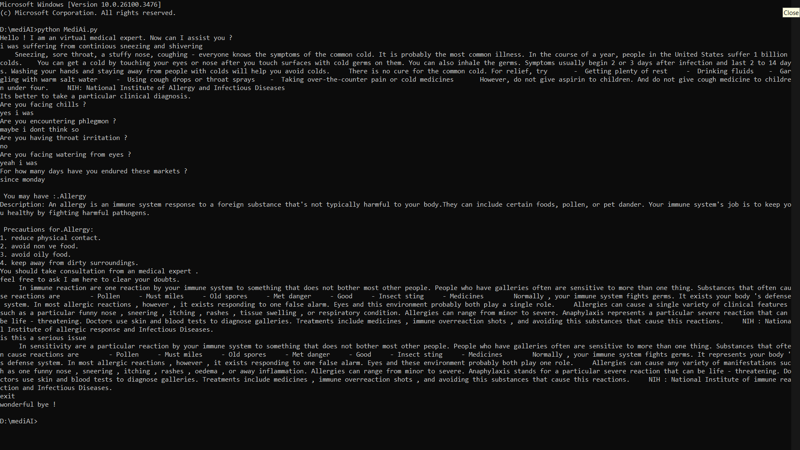

# MediAI: Virtual Doctor Chatbot 🤖💊

MediAI is a web-based AI chatbot designed to assist users with preliminary medical diagnosis based on symptoms and general medical queries. It uses machine learning models like Extra Trees Classifier for disease prediction and Sentence-BERT for natural language question-answering. The bot can also recommend nearby specialists using geolocation APIs.

---

## 🧠 Features

- 🔍 Symptom-based disease prediction using ExtraTreesClassifier
- 🗣️ Natural language Q&A with SBERT (Sentence-BERT)
- 📍 Doctor recommendation based on user geolocation
- 💬 Clean and simple chatbot web interface
- 📊 High accuracy (85–90%) in predicting common illnesses
- 🌐 Works on all modern browsers (desktop & mobile)

---

## 🛠️ Tech Stack

| Component     | Technology                         |
|---------------|-------------------------------------|
| Frontend      | HTML, CSS, JavaScript              |
| Backend       | Python with Flask                  |
| ML Models     | Extra Trees Classifier, SBERT      |
| Data Storage  | CSV files (Symptoms, Diseases, Doctors) |
| APIs          | Geolocation API                    |

---

## 🧪 Requirements

Install Python 3.8 or higher.

Install dependencies:

```bash
pip install -r requirements.txt
```

Required packages include:

- pandas
- numpy
- scikit-learn
- sentence-transformers
- Flask
- geopy

---

## 🚀 How to Run the Project

1. **Clone the repository**:

```bash
git clone https://github.com/nosij-playz/MediAi-chatbot.git
cd MediAi-chatbot
```

2. **Install dependencies**:

```bash
pip install -r requirements.txt
```

3. **Run the Flask server**:

```bash
python app.py
```

4. **Open the app in browser**:

```
http://127.0.0.1:5000
```

---
## 📄 Project Report

You can view the full project report here:  
👉 [**Click to View Report**](report/MediAi%20report.pdf)
---

## 📷 Screenshots




## 📚 References

- [1] *Human Disease Prediction based on Symptoms*, IEEE ICCMC 2023  
- [2] *Disease Prediction using Machine Learning Algorithms*, IEEE ICACITE 2022  
- [3] *Disease Prediction System Using Machine Learning Approaches*, IEEE ICAECT 2024  
- [4] *AI Chatbot for Answering FAQs*, IEEE SeFeT 2022


---

## 📌 License

This project is developed for academic and educational use under APJ Abdul Kalam Technological University guidelines.

---
